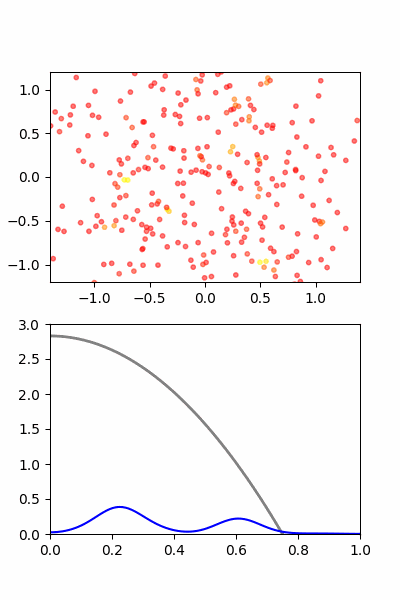
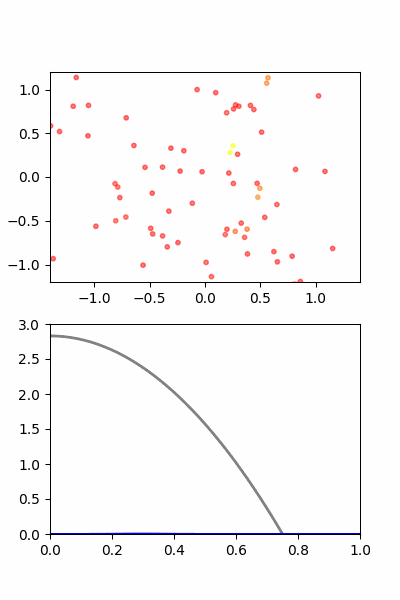
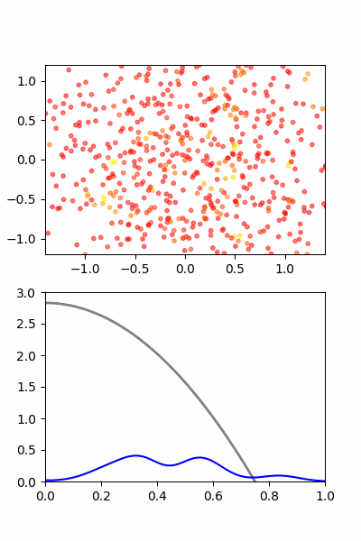
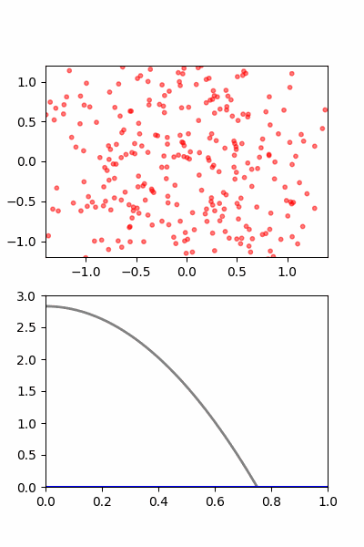
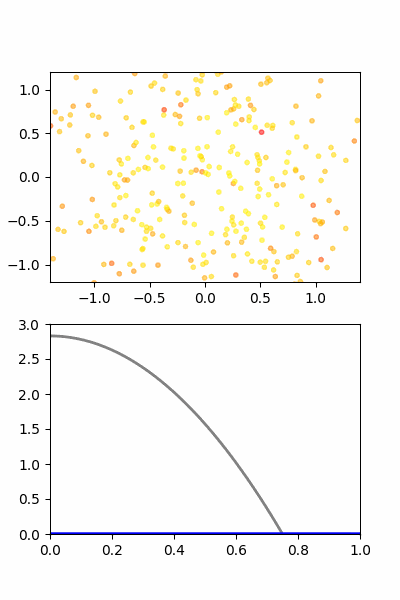
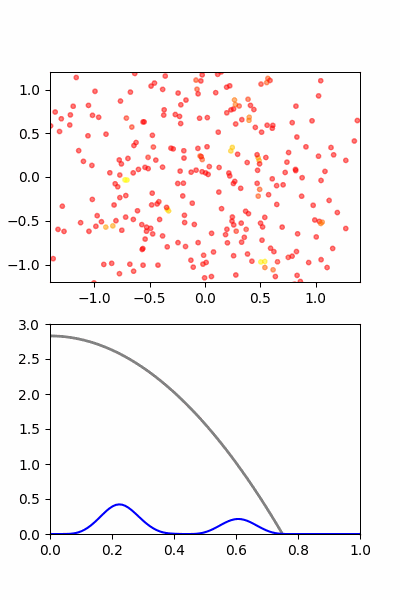
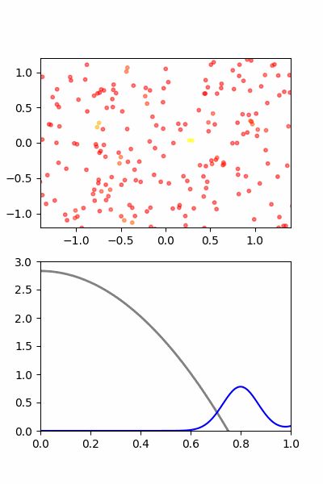
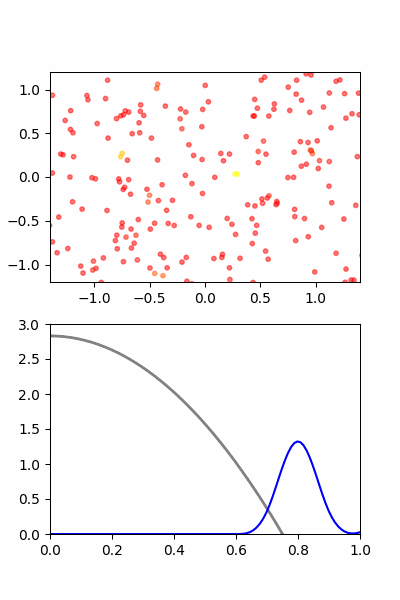

# Lab. 4   Smoothed-Particle-Dynamics   LUKASZ ZAJAC

How parameters affect visualizzation
```python
N         = 400    # Number of particles 
h         = 0.1    # smoothing length 
nu        = 1      # damping/viscosity 
```
baseline with parameters above



N makes more points, by which ball is rounder
| Impact of N | |
|-------------|---|
| N=100       | N=800 |
|  |  |


h makes simulation more aggressive and after collision seems that particles have more force back and expand further
| Impact of h | |
|-------------|---|
| h=0.001       | h=3 |
| | |


much slower movement and velocity almost disappearing before first impact
| Impact of nu | |
|-------------|---|
| nu=0.1       | nu=8 |
| ||


|Kernel| |
|--------|-----|
| Baseline | Spline |
||  |


Colliding was implemented by moving half of points to left, half right and set their init velocity at each other

| 2 stars coliding on kernels| |
|--------|-----|
| Baseline | Spline |
|        |  |


